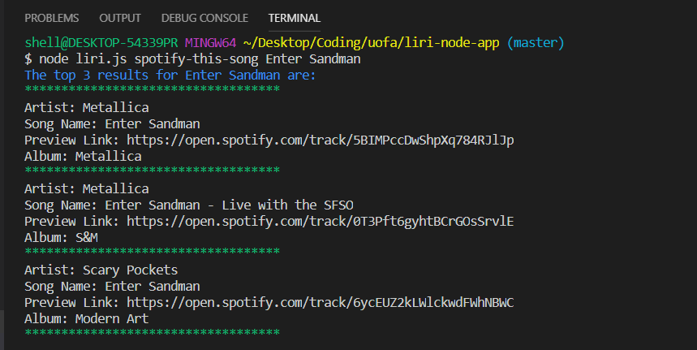
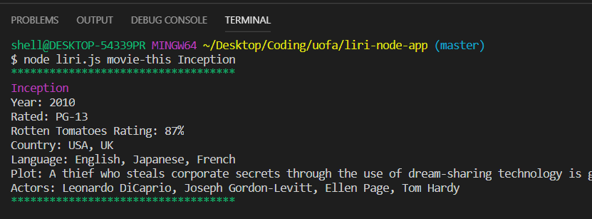
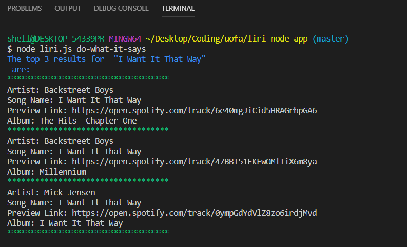

# liri-node-app

LIRI is like iPhone's SIRI. However, while SIRI is a Speech Interpretation and Recognition Interface, LIRI is a Language Interpretation and Recognition Interface. LIRI is a command line node app that takes in paramaters and gives you back data.

If you want to search concert information for one of our favorite bands just enter in the terminal: "node liri concert-this <artist/band name>". Example:

If you want to search for a favorite song, enter im the terminal: "node liri spotify-this-song <song name>". Liri will return data from Spotify that will include the Artist, Song Name, Preview Link, and Album Name. Example:

If you do not enter a specific song, Liri will show a default. Example:

If you would like to search for movie information, enter in the terminal: "node liri movie-this <movie name>". Liri will return information for that movie like the Year, Rating, Language and Plot. Example:

If you do not enter a specific movie, Liri will show a default. Example:

Liri can also import text from a .txt file and run commands in that file. Example:

If Liri does not recognize the command you entered you will get a default error message. Example:

